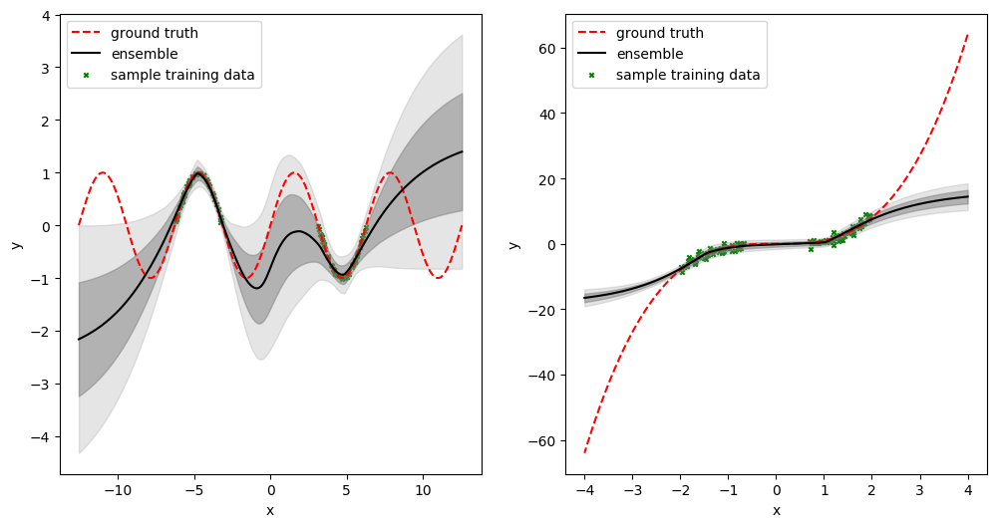

# Probabilistic Network Ensemble 
PyTorch implementations that trains an ensemble of probabilistic neural networks to fit data of toy problems, effectively replicating the results from
* [Lakshminarayanan _et al._, Simple and Scalable Predictive Uncertainty Estimation using Deep Ensembles (2017)](https://papers.nips.cc/paper/7219-simple-and-scalable-predictive-uncertainty-estimation-using-deep-ensembles.pdf)
* [Chua _et al._, Deep Reinforcement Learning in a Handful of Trials using Probabilistic Dynamic Models](https://arxiv.org/abs/1805.12114)

Currently implements two data sets: 
* A simple sine wave `y = sin(x)`
* A simple curve `y = x**3`


Grey and lighter grey areas show 1 and 2 standard deviations respectively.

## Requirements
In addition to the standard Python 3 libraries, to run the code you will need:
* PyTorch
* mpi4py

## Executing the code
Executing the code is done through the `run.sh` bash file which requires the script to execute and has an additional plotting flag. For general use please execute
```
    bash run.sh toy.py plot
```
which trains the network and plots the figures. After training, the output models are stored in the `/data/` directory and can be plotten by simply calling `python plot.py`. Additionally, the plots can be saved with an additional `save` argument, e.g. `python plot.py save` saves the figures in the `/figures/` directory.

### Comments
* Note that the implementation is rather naive and might not work for different data sets, other architectures, different hyperparameters, etc.
* To ignore the parallel computation one can simply run the code with `python toy.py` and increasing the `ensemble_size` to any desired size. This will execute the program on a single core.
* Number of ensembles can be increased by increasing the number of cores within `run.sh`. I have used 4 cores, since my laptop has 4 cores.

For any further questions, please do not hesitate to contact me.
